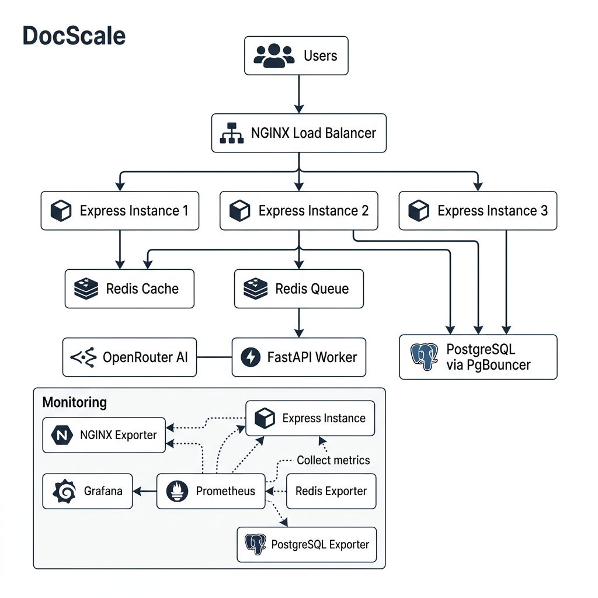
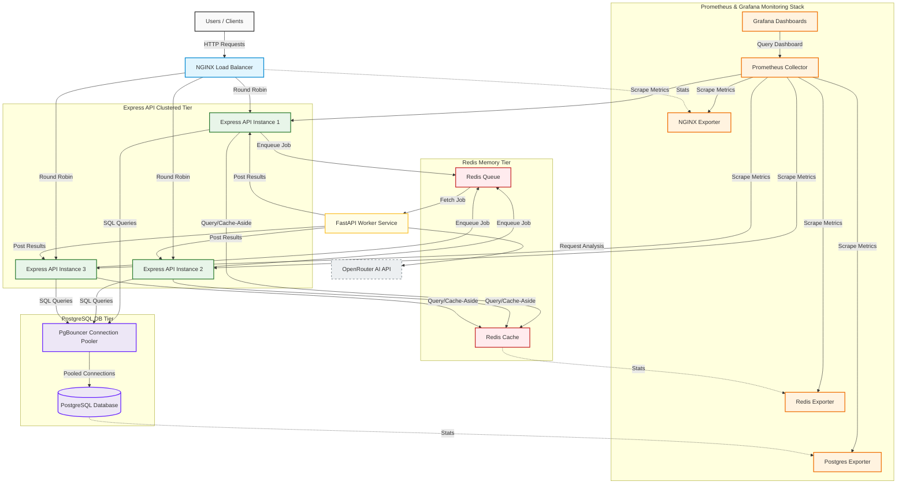

# DocScale Architecture Details

This document contains both the graphical architecture diagram and the raw Mermaid source code representing the DocScale platform topology, including the application pathways, data stores, worker nodes, and the observability stack.

---

## Technical System Architecture

Below is the visual system design diagram depicting the flow of user actions and the telemetry gathering endpoints:

---

## Mermaid System Architecture Code

You can render or inspect the system architecture via the following Mermaid diagram:

